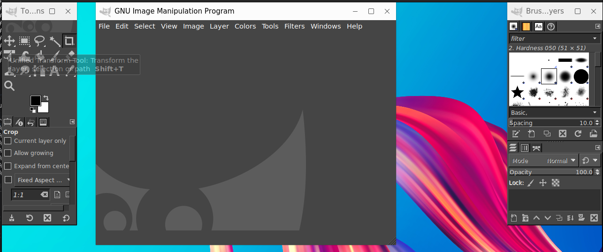

#  GIMP 主窗口

## 摘要 

GIMP 用户界面现在有多窗口模式、单窗口模式两种模式。

## 操作步骤

首次打开 GIMP 时，默认以单窗口模式打开。 您可以通过取消选中图像菜单栏中的 Windows -> 单窗口模式选项来启用多窗口模式。退出 GIMP 后，下次 GIMP 将以您选择的模式启动。

主窗口默认展示：启动 GIMP 查看窗口展示，默认展示单窗口模式

## 预期效果

## 实际效果

与预期效果一致。

#### 截图

## 其他说明

无。
