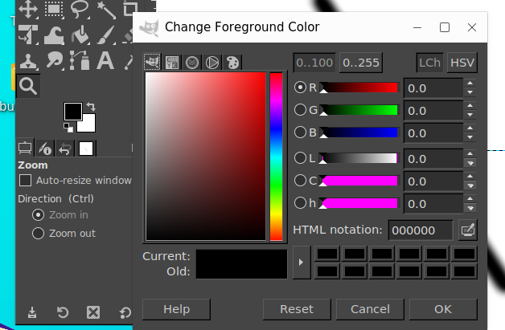
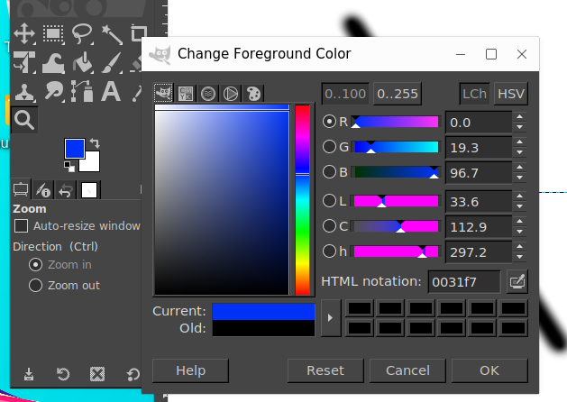
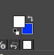
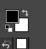

# 前景色/背景色

## 摘要

使用 GIMP 中的前景色/背景色。

## 操作步骤

这里的颜色区域显示了 GIMP 当前的前景色和背景色，它们在许多操作中都会发挥作用。单击其中一个会弹出一个颜色选择器对话框，允许您更改为不同的颜色。单击双头箭头交换两种颜色，单击左下角的小符号将它们重置为黑色和白色。

## 预期效果

## 实际结果

功能正常运行。

前景色设置为蓝色。

切换前景色,背景色。

重置为黑白色。

## 其他说明

此测试与 [背景色.md](./背景色.md) 重复。
