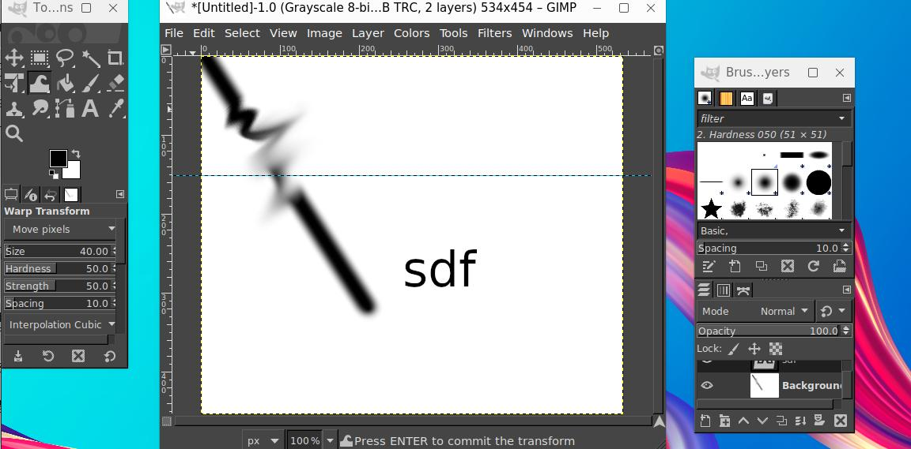

# 图像窗口

## 摘要

GIMP 的图像窗口中所包含的内容以及使用方法。

## 操作步骤

在 GIMP 中打开的每个图像都显示在一个单独的窗口中。多张图片可以同时打开，仅受系统资源限制。在您可以在 GIMP 中做任何有用的事情之前，您需要至少打开一个图像窗口。图像窗口包含 GIMP 主要命令的菜单（文件、编辑、选择...），您也可以通过右键单击窗口来获得该菜单。

图像可以大于图像窗口。在这种情况下，GIMP 会以缩小的缩放级别显示图像，从而可以在图像窗口中看到完整的图像。如果您转到 100% 缩放级别，则会出现滚动条，让您可以平移图像。

画笔、图案、字体、文档历史停靠 - 请注意，停靠中的对话框是选项卡。 

“画笔”选项卡已打开：它显示绘画工具使用的画笔类型。

图层、通道、路径：画笔对话框下方的停靠对话框显示了用于管理图层、通道和路径的对话框（选项卡）。图层选项卡已打开：它显示当前活动图像的图层结构，并允许以多种方式对其进行操作。可以不使用图层对话框来做一些非常基本的事情，但即使是中等复杂的 GIMP 用户也发现始终使用图层对话框是必不可少的。

## 预期效果

各个子功能正常。

## 实际效果

与预期效果一致。

### 截图

## 其他说明

无。
