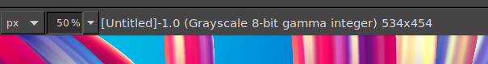
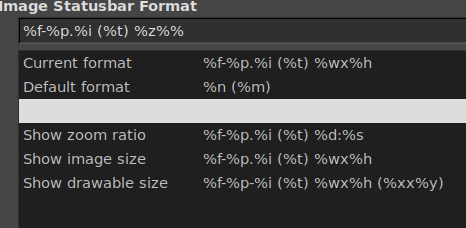
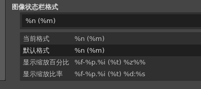

# 状态区

## 摘要

GIMP 中的状态区说明。

## 操作步骤

状态区位于图像窗口的底部。默认情况下，状态区显示 image.xcf 文件的原始名称，以及图像使用的系统内存量。请使用编辑 -> 首选项 -> 图像窗口 -> 标题和状态自定义状态区域中显示的信息。在耗时操作期间，状态区会暂时显示正在运行的操作以及操作的完成情况。

## 预期效果

功能正常运行。

## 实际效果

与预期效果一致。但选择按钮显示效果有问题。

错误如下:

选择项文本前景色与背景色一致。

正常应可看出文字

已选中选择项:

## 其他说明

请注意，图像使用的内存与图像文件大小有很大不同。例如，一个 70 kB 的 .PNG 图像在显示时可能会占用 246 kB 的 RAM。内存使用量的差异有两个主要原因。首先，.PNG 文件是压缩格式，图像在 RAM 中以未压缩的形式重构。其次， GIMP 使用额外的内存和图像副本，以供 Undo 命令使用。
