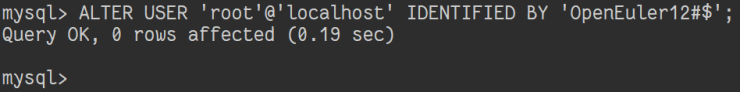

# 修改密码

## 摘要

修改 MySQL 用户：root 的登录密码。

## 操作步骤

1. 在 MySQL 中执行` ALTER USER 'root'@'localhost' IDENTIFIED BY 'test_change_password';`
2. 退出 MySQL。
3. 使用新密码登录 MySQL 用户：root。

## 预期结果

修改 MySQL 用户密码成功且能够使用新密码登录。

## 实际结果

成功

### 截图

## 其他说明
