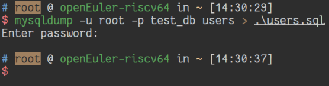

# 备份表格

## 摘要

备份数据库 “test_db” 中的表格 “users_back”。

## 操作步骤

1. 启动 Terminal
2. 执行 `mysqldump -u root -p test_db users_back > ./users.sql`
3. 输入密码并回车

## 预期结果

备份表格成功。

## 预期结果

备份表格成功。

### 截图

## 其他说明
