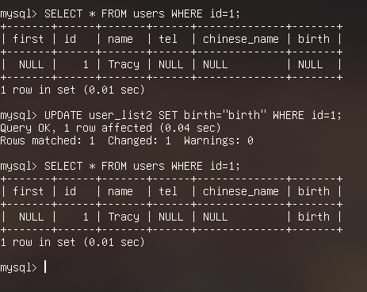

# 通过视图修改相应原始表格的记录

## 摘要

更改名为 “user_list2” 的视图中 “id” 为 1 的记录中，字段 “birth” 的值。

## 操作步骤

在 MySQL 中执行 `UPDATE user_list2 SET birth="birth" WHERE id=1;`

## 预期结果

更改记录成功。

## 实际结果

更改记录成功。

### 截图

## 其他说明
