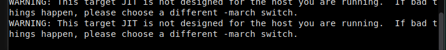

# 修改刷新率
## 操作步骤
1. 打开设置
2. 点击 System
3. 修改相应设置
## 预期结果
刷新率被修改
## 实际结果
点击 System 后程序卡住。

终端报错：

WARNING: This target JIT is not designed for the host you are running. If bad things happen, please choose a different -march switch

## 其他说明
无。

