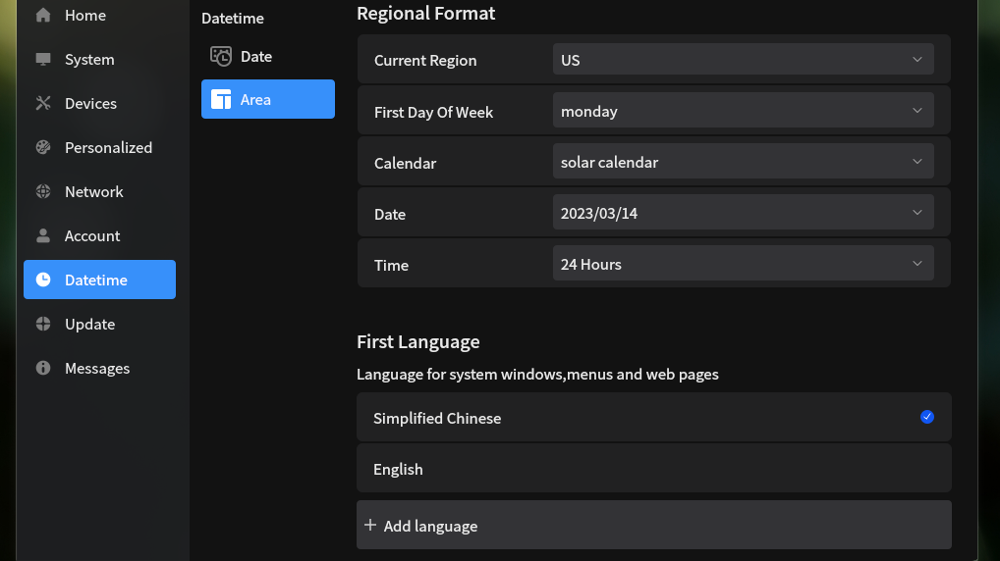

# 设置界面修改语言

## 操作步骤
打开设置
选择 Datetime > Area > First Language

选择一种语言，在弹出页面中选择重启

## 预期结果

界面语言被改变

## 实际结果
与预期不符

登录界面语言被改变，但进入桌面环境后语言设置未被改变， LANG 环境变量为 C.UTF-8。

疑似 /etc/profile.d/lang.sh 的问题

## 其他说明

无。
