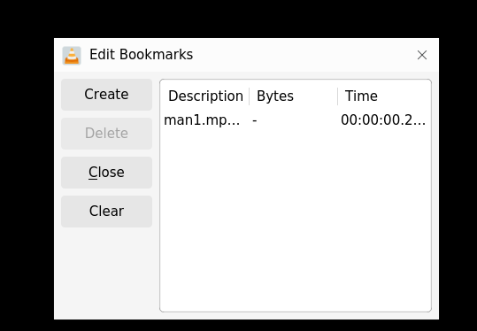

# 书签

## 摘要

使用书签功能。

## 操作步骤

要为视频中的场景添加书签，请按照以下步骤操作：

1. 在菜单栏上，点击 Menu ‣ Playback。

2. 选择自定义书签。当您单击自定义书签时，将显示一个下拉菜单。请从下拉菜单中单击管理以打开编辑书签对话框。

3. 要创建书签，请单击创建以显示当前曲目。单击 Create 后，创建的书签会出现在 Edit Bookmarks 对话框中。

## 预期结果

正常使用书签功能。

## 实际结果

与预期效果一致

### 截图

## 其他说明

本文中，**预期结果**中不含有图片，但不影响测试者理解预期结果。
