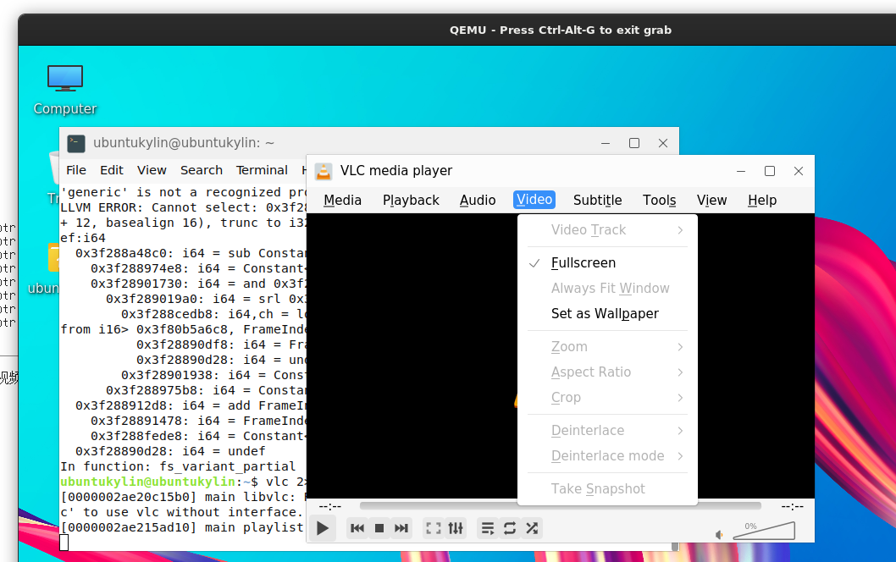
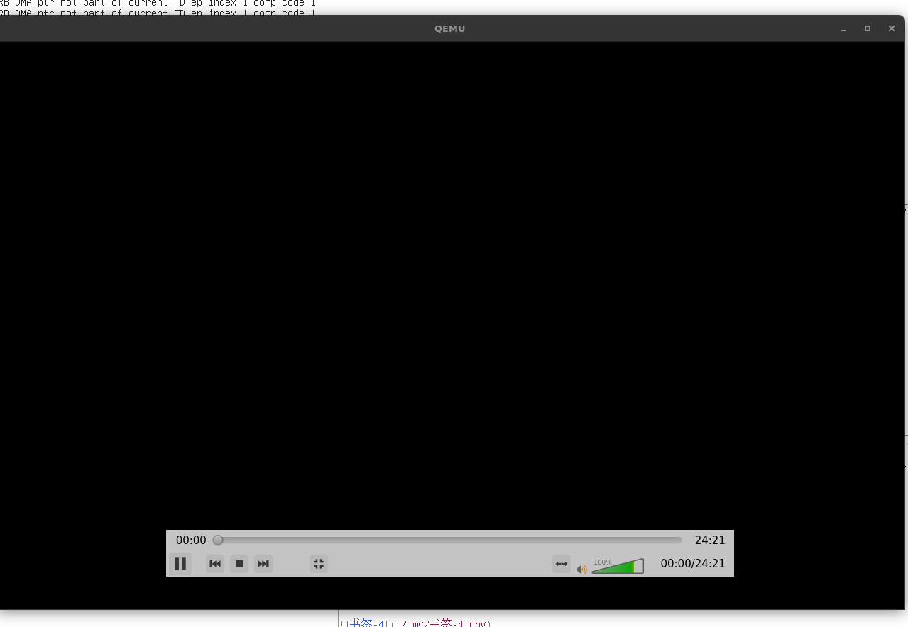

# 全屏

## 摘要

以全屏模式观看视频。

## 操作步骤

选择视频 ‣ 全屏。然后视频将占据整个屏幕。

要返回原始模式，请按 Esc 键盘或右键单击鼠标并选择离开全屏选项。然后视频将返回其原始模式。

## 预期结果

正常打开全屏播放。

## 实际结果

播放时能够全屏, 但随后崩溃, 同 [播放文件.md](./播放文件.md)

### 截图

## 其他说明

本文中，**预期结果**中不含有图片，但不影响测试者理解预期结果。
