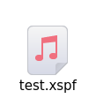

# 媒体菜单

## 摘要

控制当前正在播放的媒体的所有内容。

## 操作步骤

在此菜单中，您可以：

- 打开一个新文件以从任何位置播放。
- 将文件流式传输到 Web、本地网络或文件。
- 将播放列表转换并保存到文件。
- 退出 VLC。

## 预期结果

正常控制媒体播放内容。

## 实际结果

部分测试因无法播放视频无法进行, 见 [播放文件.md](./播放文件.md)。

- 打开一个新文件以从任何位置播放。
因无法播放视频无法进行, 见 [播放文件.md](./播放文件.md)。
- 将文件流式传输到 Web、本地网络或文件。
因无法播放视频无法进行, 见 [播放文件.md](./播放文件.md)。

- 将播放列表转换并保存到文件。
测试成功

- 退出 VLC。
测试成功

## 其他说明

本文中，**预期结果**中不含有图片，但不影响测试者理解预期结果。
