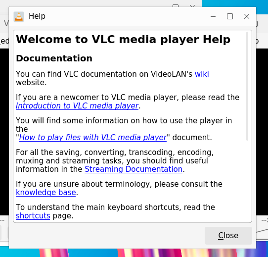
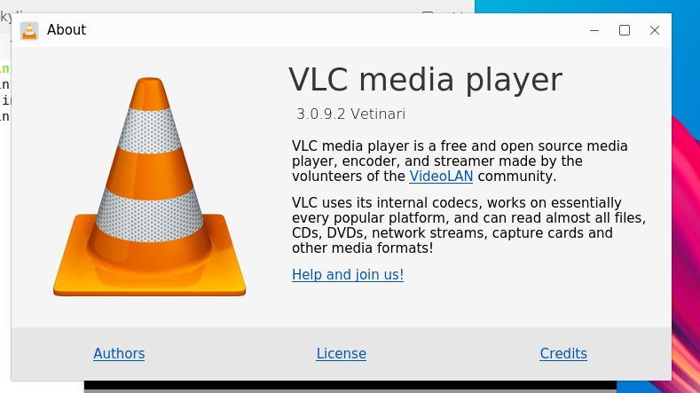

# 帮助菜单

## 摘要

此菜单包含了 VLC 中与使用帮助相关的选项。

## 操作步骤

在此菜单中，您可以：

- 使用该程序获得更多帮助。
- 检查 VLC 的更新。
- 查看 VLC 的开发者，开发和许可证。

## 预期结果

正常查阅需要的帮助说明。

## 实际结果

与预期效果一致。

### 截图

## 其他说明

本文中，**预期结果**中不含有图片，但不影响测试者理解预期结果。
