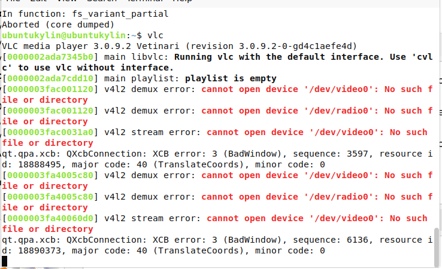

# 录制您的网络摄像头

## 摘要

录制网络摄像头。

## 操作步骤

- 选择 Media ‣ Open capture Device,
- 在下拉菜单中选择输入设备，
- 然后单击视频复选框。


单击播放按钮上的箭头，然后选择转换。


在配置文件下单击下拉列表以选择所需的输出格式。


单击浏览以选择保存位置。


单击开始开始录制。


单击停止按钮停止停止录制。您的视频将存储在您选择的目的地。

## 预期结果

正常录制网络摄像头。

## 实际结果

测试失败




```
Your input can't be opened:
VLC is unable to open the MRL 'v4l2://'. Check the log for details.
```

## 其他说明

本文中，**预期结果**中不含有图片，但不影响测试者理解预期结果。
