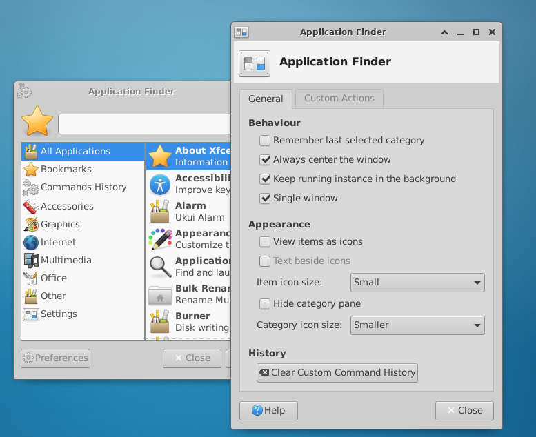
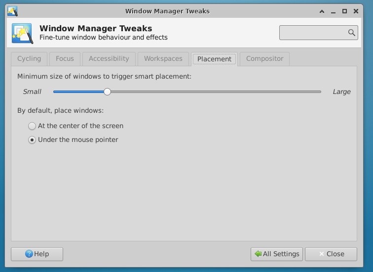

# 窗口中置

## 摘要

- 通过设置强制使应用启动时窗口处于屏幕中心

## 操作步骤

1. 打开Preference（首选项或偏好设置）
2. 勾选：Always centre the window
3. 关闭后再次打开

## 预期结果

启动时窗口处于屏幕中心

## 实际结果

与预期效果一致

## 其他说明

须在 Window Manager Tweaks > Placement 中

By default, place windows:  选项中选择 Under the mouse pointer 方可显示效果

见 https://docs.xfce.org/xfce/xfce4-appfinder/preferences :
> Always centre the window
>     By default, Xfwm4 might position the window in a place that isn't in the centre of the screen (see the section Placement under Window Manager Tweaks to change this behaviour). Select this option to always centre the Application Finder screen on startup, regardless of Window Manager settings.
