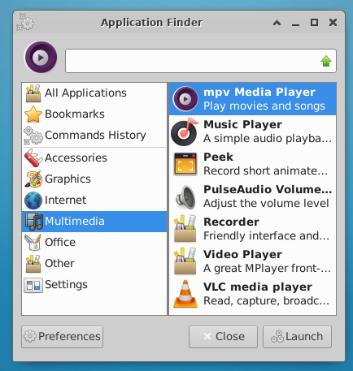

# 记忆上次搜索分类

## 摘要

- 在选项中打开，记忆上次搜索分类

## 操作步骤

1. 打开Preference（首选项或偏好设置）
2. 勾选：Remember last selected category
3. 关闭后再次搜索

## 预期结果

- 出现上次搜索分类，如，上次本人打开了Education分类，关闭Finder后重新打开，开始打开的仍然是这个分类

## 实际结果

与预期效果一致。

## 其他说明

需打开相关分类应用才会记忆, 仅切换分类而不打开则不会记忆。
