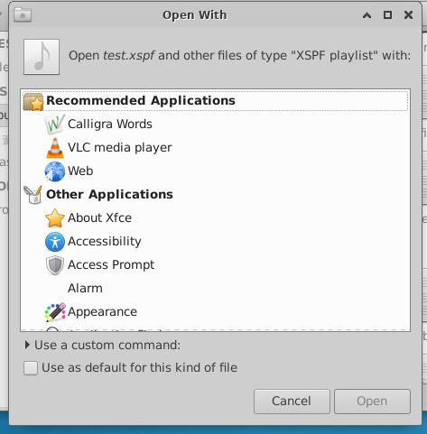

# Open with other Application 测试

## 摘要

在 Xfce 中的 File 下 选中一个文件并 Open with other Application 。

## 操作说明

在 File 中选中一个文件后 -> Open with other Application 。

## 预期结果

功能正常运行。

## 实际结果

与预期效果一致

## 其他说明

无。
