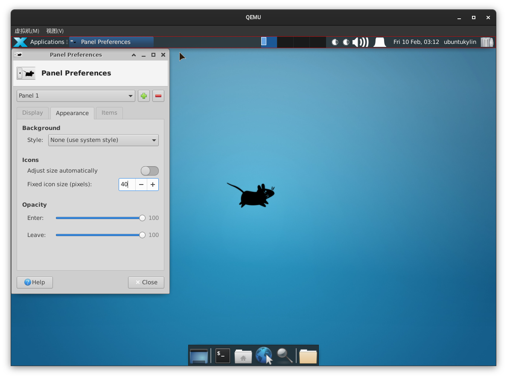
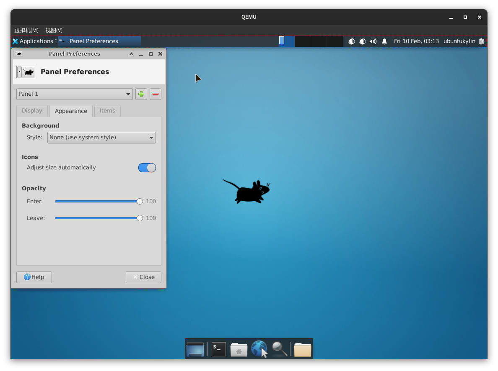

# 自动调整 Icons 大小设置

## 摘要

测试能否正常设置自动调整 Icons 大小。

## 操作步骤

在 Panel Preferences -> Appearance -> Icons -> Adjust size automatically ：设定为 on 。

## 预期结果

可以正常设置，但是桌面上显示不明显。

## 实际结果

与预期效果一致

设为 on 之后:

## 其他说明

无。
